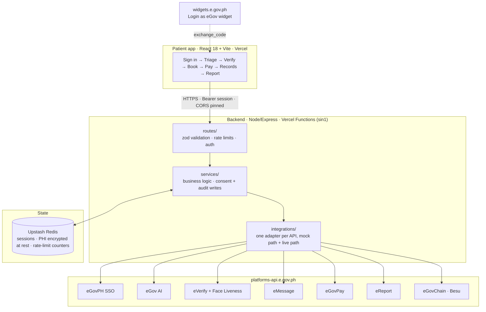
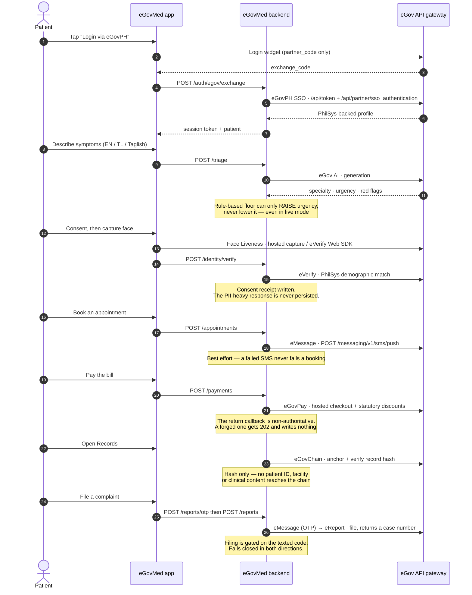

# eGovMed

**The smart front door to public healthcare.** A web app that runs AI symptom triage, verified
identity, portable medical records, and payments on top of the Philippine government's eGov API
stack. Pilot target: Philippine General Hospital (PGH).

> One login, one medical record, one payment. Patients stop re-entering data, stop repeating
> labs, and stop lining up to pay.

**Live app:** [egovmed.vercel.app](https://egovmed.vercel.app) ·
**API:** [egovmed-api.vercel.app/health](https://egovmed-api.vercel.app/health)
**Team:** Bisaya-Hackers (UP Manila) · **Event:** eGov Hackathon PH 2026
**Stack:** React 18 + Vite · Node/Express · Upstash Redis · Hyperledger Besu · Vercel

All eight eGov APIs run **live** against the API Developer Portal gateway
(`https://platforms-api.e.gov.ph/<service>`). No legacy `hackathon-*` host is in use.
Sign in with a sandbox account — mobile number `+639090000001` through `+639090000005`,
one-time code `123456`, PIN `000000`. The sign-in dialog lists them.

---

## The flow

1. **Sign in** with an eGovPH account. The patient profile auto-fills from SSO.
2. **Describe symptoms** in English, Tagalog, or Taglish. Triage returns a specialty, an urgency
   level, and red flags.
3. **Verify identity** with consent: a face liveness capture plus a PhilSys demographic match.
4. **Book** an appointment and get a queue number, with an SMS confirmation.
5. **Pay** through the unified government gateway, with statutory discounts applied.
6. **Records** are encrypted at rest, and their hashes are anchored on-chain so tampering is
   detectable.

## The 8 eGov APIs

| API | Role |
|---|---|
| **eGovPH SSO** | Login to session, auto-fill the patient profile |
| **eGov AI** | Symptom triage and translation to `{specialty, urgency, red_flags}` |
| **National ID eVerify** | Match against PhilSys with consent, gate record access |
| **Face Liveness** | Confirm a live person during ID capture (anti-abuse) |
| **eMessage** | Confirmations and reminders over SMS |
| **eGovChain** | Anchor record hashes on Besu for tamper evidence |
| **eGovPay** | Settle bills through the unified gateway |
| **eReport** | File and track complaints by case number, escalate stale ones |

---

## Integration status

Every integration runs in one of two modes, `mock` or `live`, selected per service by an
environment variable. This is deliberate: development costs no API credits, and the demo stays
functional when a government endpoint is down. No integration was flipped to `live` until its
credentials and response shape had been verified against the real API.

**All eight are live in production.** `GET /integrations/status` (admin-keyed) reports the
running state at any moment; the table below is what it returns today.

| eGov API | Prod mode | Gateway base | What it does here |
|---|---|---|---|
| **eGovPH SSO** | **live** | `platforms-api.e.gov.ph/egov-sso` | Login as eGov widget → `exchange_code` → session, profile auto-fill |
| **eGov AI** | **live** | `platforms-api.e.gov.ph/egov-ai` | Symptom triage, EN/TL/Taglish → `{specialty, urgency, red_flags}` |
| **eVerify** | **live** | `platforms-api.e.gov.ph/everify` | PhilSys demographic match under recorded consent; gates record access |
| **Face Liveness** | **live** | `platforms-api.e.gov.ph/face-liveness` | Live-person capture during ID verification |
| **eMessage** | **live** | `platforms-api.e.gov.ph/emessage` | Appointment confirmations, reminders, report-filing OTP |
| **eGovChain** | **live** | `platforms-api.e.gov.ph/egovchain/{token}` | Hash-only record anchoring on Besu (calldata strategy) |
| **eGovPay** | **live** | `platforms-api.e.gov.ph/egovpay` | Hosted checkout with statutory discounts applied |
| **eReport** | **live** | `platforms-api.e.gov.ph/ereport` | File and track complaints by case number, auto-escalate stale ones |

`ALLOW_MOCK_IN_PRODUCTION` is the guard that stops a mocked integration serving fake data to a
real citizen: with it off, the backend refuses to boot unless all eight are live **and**
credentialed, and names the offender. It stays on only for an explicitly labelled demo build.

### Two things worth knowing before you integrate against this stack

**Gateway calls are metered, and blockchain RPC reads are not free.** One shared pool of 500
credits covers all eight APIs. Standard Ethereum tooling (`tx.wait()`, `waitForDeployment()`)
polls `eth_getTransactionReceipt` in a loop, and every poll is a billed gateway call — that is
536 requests and an emptied allowance in under five minutes. eGovChain is therefore submit-once,
check-once, never in a loop, and record anchoring uses a calldata strategy rather than a deployed
contract. See [CLAUDE.md](CLAUDE.md) for the full rules.

**`face_liveness_session_id` has two documented sources and only one works.** The Face Liveness
doc says reuse its hosted session token; the eVerify doc says use the eVerify Web SDK. We settled
it by testing, not reading: querying eVerify with a real completed hosted session, and again with
a random UUID as a control, returned byte-identical `face_liveness_error_exception` responses.
The hosted token is not interchangeable. Without the control query the first result would have
been unreadable, since a rejection could equally have meant a bad demographic match.
`VERIFICATION_METHOD` switches between the two paths in one place.

---

## Security engineering

The threat model assumes real patient health information, so most of the engineering effort
went here rather than into features.

**Protecting health data**
- PHI is encrypted at rest with a versioned envelope. The decryptor reads both v1 and v2 records
  so a format change never orphans existing data.
- On-chain anchoring is hash-only. `anchorLive` strips payloads down to `{type, anchoredAt}`
  before submission, so no patient ID, facility, or clinical content ever reaches the chain
  (Data Privacy Act 2012).
- Identity verification writes an auditable consent receipt. The eVerify response carries heavy
  PII that is deliberately never persisted beyond the fields the service already stores.
- Message bodies are never written to the audit log, with a regression test asserting it.

**Preventing abuse**
- Liveness sessions are single-use, patient-bound, and expire in 10 minutes. The claim is a
  Redis Lua compare-and-set, so two simultaneous replays resolve to exactly one success and one
  rejection. A concurrency test asserts this.
- Rate limiting is Upstash-backed and therefore shared across serverless instances, with a
  global ceiling plus tighter per-route budgets on auth and callback endpoints.
- Admin routes compare keys in constant time.
- Payment callbacks are treated as non-authoritative. A forged callback returns 202 and writes
  nothing.

**Hardening the perimeter**
- Outbound HTTP enforces HTTPS-only, with HTTP allowed on loopback alone. The check lives at the
  transport, so a future refactor cannot reintroduce SSRF by forgetting it at one call site.
- Strict security headers on every response: CSP, HSTS, `X-Frame-Options: DENY`, nosniff,
  `Referrer-Policy: no-referrer`.
- CORS is pinned to the exact production frontend origin.
- Secrets are Sensitive-typed in Vercel, which makes them unreadable after they are set. Preview
  deployments intentionally cannot boot, so no preview build can reach production data.

**Failure behavior is chosen, not accidental**
- Anchor writes **fail closed**. An unverifiable record is never stored.
- Anchor verification **fails safe**. An RPC error yields `verified: false` rather than a green
  badge.
- Notifications are **best effort**. A failed SMS never fails a booking, but it is logged.
- The AI triage classifier has a rule-based floor that can only raise urgency, never lower it.
  It stays in force in live mode, so a degraded or hostile model response cannot downgrade an
  emergency.
- With `ALLOW_MOCK_IN_PRODUCTION` off, the app **refuses to boot** if any integration is still
  mocked or missing credentials, naming the offender. A silent mock cannot serve fake triage or
  payment data to a real patient.

**Verification**
- 59 backend tests, security regression suite included, required to pass before merge.
- CI runs backend tests, dependency audits on both packages, CodeQL `security-extended`, and a
  TruffleHog secret scan.
- Branch protection on `main` with those checks required and force-push blocked.

Full audit trail: [docs/security-review-mock-to-live.md](docs/security-review-mock-to-live.md)
and [docs/pentest-handoff.md](docs/pentest-handoff.md).

---

## Architecture

### System flow

Where a patient's request goes, and which government API it touches on the way.



The backend is client-agnostic on purpose. An assisted kiosk client for walk-in patients with no
phone plugs in as a second client with no backend changes.

### eGov API integration points

Each numbered step is one citizen action and the API call it makes.



### Repository layout

```
frontend/
  src/screens/         One file per screen (SignIn, Triage, Records, Payments, Report…)
  src/components/      Shared UI, PinInput, ProfileSetup, icons
  src/lib/             API client, eGovPH login widget loader, eVerify SDK loader
  src/i18n/            EN + TL copy in one dictionary
backend/
  src/routes/          Express routers — zod validation and rate limits at the edge of each route
  src/services/        Business logic, storage, consent and audit writes
  src/integrations/    One adapter per eGov API, each with a mock and a live path
  src/store/           Pluggable driver — Upstash Redis in prod, in-memory for tests
  src/lib/             Crypto, HTTP client with the SSRF guard, recipient resolution, logging
  src/config/env.js    Every environment variable, with boot-time validation
  test/                Security regression suite
contracts/             RecordAnchor.sol, Solidity 0.8.20
apidocumentation/      The portal's own API docs, kept in-repo for reference
docs/                  Deployment, security review, pentest notes, design handoff
```

Every integration adapter carries a mock path, so the whole product runs offline with no
credentials at all. That is what makes the demo resilient to sandbox outages.

---

## Getting started

### Prerequisites

| | Version | Why |
|---|---|---|
| **Node.js** | **18 or newer** (24.x in production) | The backend `engines` field requires it; the code uses the global `fetch` and the built-in `node --test` runner |
| **npm** | 9 or newer | Ships with Node 18+. `npm ci` needs the lockfile format |
| **Upstash Redis** | any free database | **Production only.** The backend refuses to boot in production on the in-memory store. Local development uses the memory driver and needs nothing |
| **openssl** | any | To generate the three local secrets below. Git Bash on Windows includes it |

No eGov credentials are needed to run the app. `INTEGRATION_MODE=mock` (the default) runs the
whole product with zero gateway calls.

### Setup

```bash
git clone https://github.com/M4tyu633/egovmed.git
cd egovmed
```

Backend, in terminal 1:

```bash
cd backend && cp .env.example .env && npm ci && npm run dev
```

Frontend, in terminal 2:

```bash
cd frontend && cp .env.example .env && npm ci && npm run dev
```

Open `http://localhost:3000`. Vite proxies `/api` to the backend on `:4000`.

**Generate real local secrets before the first run.** `JWT_SECRET`, `PHI_ENCRYPTION_KEY` and
`ADMIN_KEY` must be real values. The crypto layer silently falls back to an ephemeral random key
in development, so records written before a restart become undecryptable after it. Run this three
times and paste the results into `backend/.env`:

```bash
openssl rand -hex 32
```

### Verify the checkout

```bash
cd backend && npm test
```

59 tests, including the security regression suite. Then:

```bash
cd frontend && npm run build
```

`npm audit --audit-level=high` must also pass in both packages. CI enforces all three.

---

## Dependencies

Nothing here is incidental. Each entry is listed with what it does in this codebase.

### Backend runtime (`backend/package.json`)

| Package | Purpose |
|---|---|
| `express` ^4.19 | HTTP server and routing |
| `zod` ^3.23 | Request body and param validation at the edge of every route. Rejections carry per-field detail rather than a generic message |
| `jsonwebtoken` ^9.0 | Signs and verifies the patient session token |
| `@upstash/redis` ^1.34 | Production store driver: sessions, encrypted PHI, rate-limit counters, and the Lua compare-and-set that keeps liveness sessions single-use across serverless instances |
| `ethers` ^6.13 | Builds and signs the eGovChain (Besu) anchoring transaction. Deliberately used **without** its polling helpers, see the credits rule above |
| `cors` ^2.8 | CORS, pinned to the exact production frontend origin |
| `morgan` ^1.10 | HTTP request logging. Message bodies are never logged, and a regression test asserts it |
| `dotenv` ^16.4 | Loads `.env` in local development. Vercel injects environment variables directly in production |

No dev dependencies. Tests run on the built-in `node --test` runner and crypto comes from
`node:crypto`.

### Frontend (`frontend/package.json`)

| Package | Purpose |
|---|---|
| `react` / `react-dom` ^18.3 | UI |
| `gsap` ^3.12 with `@gsap/react` ^2.1 | Screen transition and stagger animations |
| `reicon-react` ^1.1 | Icon set |
| `vite` ^6.4 (dev) | Dev server with the `/api` proxy, and the production build |
| `@vitejs/plugin-react` ^4.3 (dev) | React Fast Refresh and the JSX transform |

The eGovPH login widget is **not** an npm dependency. It loads at runtime from
`https://widgets.e.gov.ph/v1.0.0/egov-login.min.js` with the version pinned in the URL, because
an unpinned third-party script can change shape under a running deployment.

---

## Environment configuration

Copy `backend/.env.example` and `frontend/.env.example`. Both are fully commented. Nothing below
carries a real value; credentials come from the eGov API Developer Portal.

### Three URLs that must agree

The most common way to break a deployment, and every symptom is a silent CORS or CSP failure with
nothing useful in the network tab:

1. backend `APP_URL`
2. frontend `VITE_API_BASE_URL`
3. `connect-src` in `frontend/vercel.json`, which is a **build-time header, not an environment
   variable**. Changing the backend origin means editing that file and redeploying.

### Backend, core

| Variable | Required | Default | Notes |
|---|---|---|---|
| `NODE_ENV` | no | `development` | `production` turns on the boot-time guards below |
| `PORT` | no | `4000` | Ignored on Vercel |
| `APP_URL` | **production** | `http://localhost:3000` | The frontend origin. Drives CORS and every redirect back into the app |
| `API_PUBLIC_URL` | **production** | derived | This backend's own public origin, used to build callback URLs |
| `JWT_SECRET` | **yes** | ephemeral | 32+ random hex. Sessions minted before a restart die with it |
| `PHI_ENCRYPTION_KEY` | **yes** | ephemeral | 32+ random hex. **Records written under an ephemeral key are unrecoverable after a restart** |
| `ADMIN_KEY` | no | unset | Gates `/integrations/status`, the escalation sweep and insights. 32+ characters in production; unset means those routes deny everyone |
| `SESSION_TTL` | no | `86400` | Seconds |
| `AUDIT_LOG_RETENTION_DAYS` | no | `90` | PHI access audit log retention |
| `ALLOW_MOCK_IN_PRODUCTION` | **production** | `false` | Must be `true` while any integration is mocked, or the backend refuses to boot and names the offender |

### Backend, storage

| Variable | Required | Default | Notes |
|---|---|---|---|
| `STORE_DRIVER` | **production** | `memory` | `kv` in production. **Production will not boot on `memory`** |
| `UPSTASH_REDIS_REST_URL` | with `kv` | | A free database from `console.upstash.com` works; region Singapore matches the `sin1` function region. The Vercel marketplace integration has no free plan |
| `UPSTASH_REDIS_REST_TOKEN` | with `kv` | | |
| `STORE_KEY_PREFIX` | no | `egovmed` | Namespaces keys so two deployments can share one database |

### Backend, integrations

`INTEGRATION_MODE` sets the global default (`mock` or `live`). Each `*_MODE` overrides it for one
service, so integrations can be flipped one at a time. Every `*_BASE_URL` already defaults to the
correct gateway path and only needs setting to point somewhere else.

| Service | Mode | Credentials | Also |
|---|---|---|---|
| eGovPH SSO | `EGOVPH_MODE` | `EGOVPH_PARTNER_CODE`, `EGOVPH_PARTNER_SECRET` | `EGOVPH_SCOPE`, `EGOVPH_LAUNCH_URL` (in-app launch only) |
| eGov AI | `EGOV_AI_MODE` | `EGOV_AI_ACCESS_CODE` | `EGOV_AI_CATEGORY` |
| eVerify | `EVERIFY_MODE` | `EVERIFY_CLIENT_ID`, `EVERIFY_CLIENT_SECRET` | `EVERIFY_PUBKEY`, served to the browser by `GET /auth/config` and safe to expose |
| Face Liveness | `FACE_LIVENESS_MODE` | `FACE_LIVENESS_API_KEY` | `FACE_LIVENESS_CALLBACK_URL` (**https only**), `FACE_LIVENESS_MIN_CONFIDENCE` (default 95) |
| eMessage | `EMESSAGE_MODE` | `EMESSAGE_AUTH_TOKEN` | `EMESSAGE_SENDER_ID` |
| eGovChain | `EGOVCHAIN_MODE` | `EGOVCHAIN_PRIVATE_KEY` (`0x` plus 64 hex) | `EGOVCHAIN_RPC_URL` carries the gateway token in its path; `EGOVCHAIN_CHAIN_ID` defaults to `13371` |
| eGovPay | `EGOVPAY_MODE` | `EGOVPAY_TOKEN`, `EGOVPAY_SETTLEMENT_TEMPLATE_UUID` | `EGOVPAY_REDIRECT_URL`, `EGOVPAY_CALLBACK_URL` (**https only**), `EGOVPAY_MOCK_OUTCOME` |
| eReport | `EREPORT_MODE` | `EREPORT_ACCESS_CODE` | `EREPORT_BASE_URL` has **no default**. Also needs `EREPORT_REGION_CODE`, `EREPORT_PROVINCE_CODE`, `EREPORT_MUNICIPALITY_CODE`, `EREPORT_BARANGAY_CODE`, plus `EREPORT_TYPE` and `EREPORT_ESCALATE_AFTER_HOURS` |

Two more that are not per-service:

| Variable | Required | Default | Notes |
|---|---|---|---|
| `VERIFICATION_METHOD` | no | `face-liveness` | `everify` uses the eVerify Web SDK capture, which is the only session eVerify's own `/api/query` accepts. `face-liveness` uses the hosted flow and leaves eVerify mocked |
| `NOTIFY_DEFAULT_PHONE` | no | unset | **Demo affordance.** eGovPH sandbox personas carry `+63909000000N` numbers no carrier delivers to, so every SMS vanishes. Set one real E.164 number and all notifications for a patient who has not set their own number in Account go there instead: confirmations, reminders, report OTPs, and the complainant contact eReport files with a case. A number the patient types in Account always wins over it. Leave it empty for a real deployment; the backend warns at every boot while it is set |

### Frontend

| Variable | Required | Default | Notes |
|---|---|---|---|
| `VITE_API_BASE_URL` | **production** | `/api` | Leave as `/api` in development, where Vite proxies it. In production, the deployed backend origin |
| `VITE_EVERIFY_SDK_ENABLED` | no | `false` | Turns on the eVerify Web SDK capture path. The backend's `VERIFICATION_METHOD` is the real switch; this is a local override |
| `VITE_EVERIFY_PUBKEY` | no | | Fallback only. The app normally reads the pubKey from `GET /auth/config`, so rotating it needs no frontend rebuild |

Every `VITE_*` value is **baked into the bundle at build time** and readable by anyone who opens
it. Nothing secret belongs in the frontend.

### Deployment

Two Vercel projects from one repository:

| Project | Root | Notes |
|---|---|---|
| `egovmed` | `frontend/` | Static build. The CSP lives in `frontend/vercel.json` |
| `egovmed-api` | `backend/` | Serverless function, region `sin1`, `maxDuration` 30s |

Set the backend variables in the Vercel dashboard as **Sensitive**, which makes them unreadable
after they are set. Preview deployments intentionally cannot boot, so no preview build can reach
production data. Setting a full set through `vercel env add` takes about four seconds per
variable; `POST /v10/projects/{id}/env?upsert=true` accepts an array in one call.

### Testing from a phone on the same Wi-Fi

Open `http://<PC-LAN-IP>:3000`. Vite listens on all local interfaces. If Windows marks the
network as Public, allow the port once from an Administrator PowerShell:

```powershell
New-NetFirewallRule -DisplayName 'eGovMed local phone testing' -Direction Inbound -Action Allow -Protocol TCP -LocalPort 3000 -RemoteAddress LocalSubnet -Profile Public,Private
```

Remove it when you are finished:

```powershell
Remove-NetFirewallRule -DisplayName 'eGovMed local phone testing'
```

Same-Wi-Fi HTTP is enough for the app and the mock adapters, but not for eGovPH SSO, hosted Face
Liveness, or eGovPay. Those need a public HTTPS origin.

---

## Build rules

1. **`.env` holds all secrets and is gitignored.** Copy `.env.example` to `.env`.
2. **Triage is decision support, not diagnosis.** Output always carries an urgency level and red
   flags, and a human confirms. Urgent patterns produce a clear instruction to seek immediate
   medical assessment.
3. **eGovChain stores only hashes, pointers, consent, and timestamps.** Raw PHI stays encrypted
   off-chain.
4. **Benefits (PhilHealth, white card, SSS) are labeled mocks.** Do not claim those APIs exist.
   The same applies to hospital systems and national medical repositories.
5. **National ID eVerify is the authoritative identity API.** No passport verification claims.
6. **Identity is the anchor.** Records, appointments, and payments all key off the eGov PhilSys
   identity.
7. **Never set the global mode to `live`** while any integration is incomplete. Flip one service
   at a time and verify before moving on.

---

## Docs

| Doc | What it covers |
|---|---|
| [docs/demo-recording-checklist.md](docs/demo-recording-checklist.md) | The 3-minute demo run: which action proves which API |
| [docs/deploy-staging.md](docs/deploy-staging.md) | Vercel deployment and the per-service go-live order |
| [docs/security-review-mock-to-live.md](docs/security-review-mock-to-live.md) | Security audit and the reasoning behind each decision |
| [docs/pentest-handoff.md](docs/pentest-handoff.md) | Penetration testing notes |
| [docs/implementation-plan.md](docs/implementation-plan.md) | Build plan |
| [docs/design-handoff.md](docs/design-handoff.md) | UI and design specs |
| [contracts/README.md](contracts/README.md) | Contract deployment and the on-chain audit trail |

## Roadmap

- Assisted kiosk client for walk-in patients with no phone or low digital literacy.
- Key versioning for `PHI_ENCRYPTION_KEY`. Rotation currently has no migration path.
- Retention and rotation policy for the PHI access audit log.
